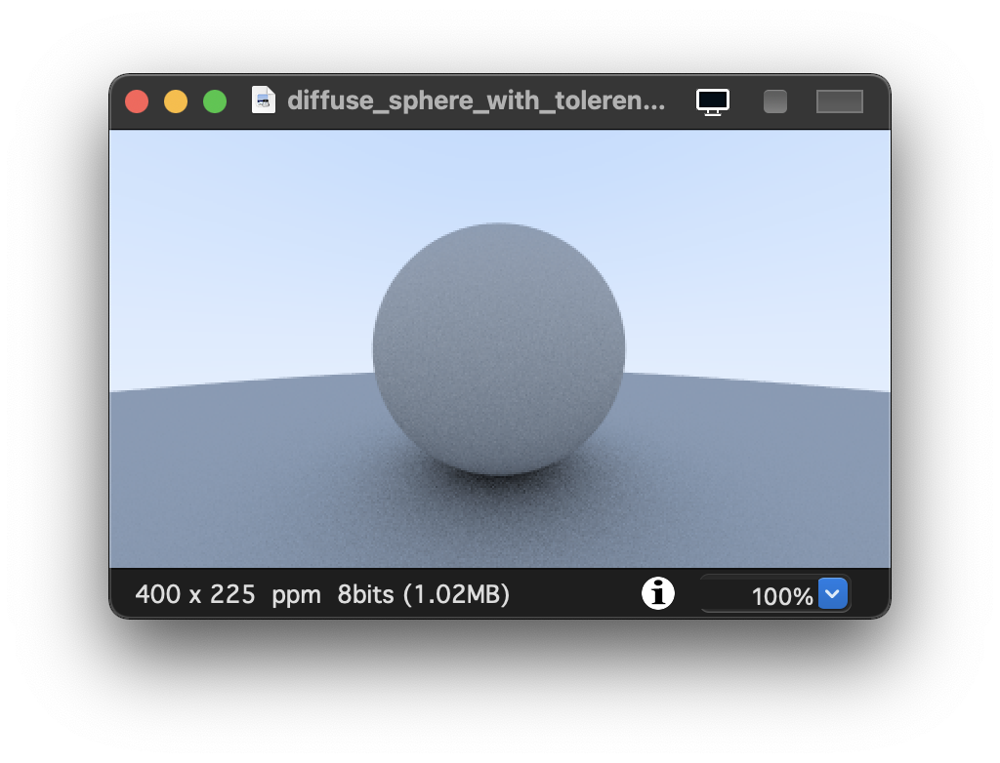
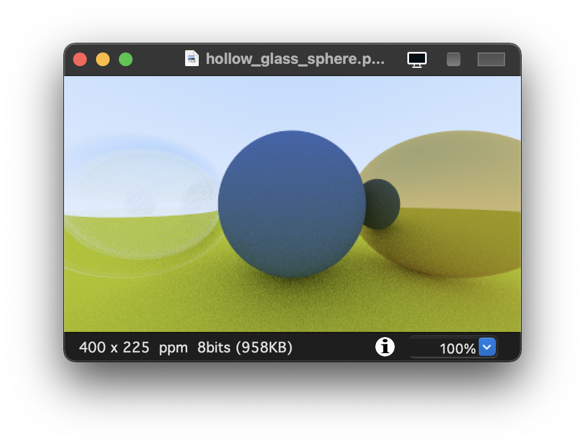

# Raytracer

## Quick start

I assume that g++ is already installed.

- For mac:
```
cd tuto
./run.sh # works on mac
```
- For windows:
```
cd tuto
# Compile the tuto file
g++ -o tuto ./tuto.cpp

# Run the script to generate the testing image
./tuto > image.ppm
```

Opening the output file (in ToyViewer on my Mac, but try it in your favorite viewer and Google “ppm viewer” if your viewer doesn’t support it) shows this result:


If you want to generate the final result:

``
cd raytracer
./run.sh # Compiles and run the script
``

- For mac:
```
cd raytracer
./run.sh # works on mac
```
- For windows:
```
cd raytracer
# Compile the raytracer file
g++ -o raytracer.exe ./raytracer.cpp

# Run the script to generate the testing image
raytracer.exe > image.ppm
```

you should get:


### The PPM Image Format

Whenever you start a renderer, you need a way to see an image. The most straightforward way is to write it to a file. The catch is, there are so many formats. Many of those are complex. I always start with a plain text ppm file. Here’s a nice description from Wikipedia:


### The ray class

The one thing that all ray tracers have is a ray class and a computation of what color is seen along a ray. Let’s think of a ray as a function 𝐏(𝑡)=𝐀+𝑡𝐛. Here 𝐏 is a 3D position along a line in 3D. 𝐀 is the ray origin and 𝐛 is the ray direction. The ray parameter 𝑡 is a real number (double in the code). Plug in a different 𝑡 and 𝐏(𝑡) moves the point along the ray. Add in negative 𝑡 values and you can go anywhere on the 3D line. For positive 𝑡, you get only the parts in front of 𝐀, and this is what is often called a half-line or ray.


### Sending Rays into the scene

Now we are ready to turn the corner and make a ray tracer. At the core, the ray tracer sends rays through pixels and computes the color seen in the direction of those rays. The involved steps are (1) calculate the ray from the eye to the pixel, (2) determine which objects the ray intersects, and (3) compute a color for that intersection point. When first developing a ray tracer, I always do a simple camera for getting the code up and running. I also make a simple ray_color(ray) function that returns the color of the background (a simple gradient).

I’ve often gotten into trouble using square images for debugging because I transpose 𝑥 and 𝑦 too often, so I’ll use a non-square image. For now we'll use a 16:9 aspect ratio, since that's so common.

In addition to setting up the pixel dimensions for the rendered image, we also need to set up a virtual viewport through which to pass our scene rays. For the standard square pixel spacing, the viewport's aspect ratio should be the same as our rendered image. We'll just pick a viewport two units in height. We'll also set the distance between the projection plane and the projection point to be one unit. This is referred to as the “focal length”, not to be confused with “focus distance”, which we'll present later.

I’ll put the “eye” (or camera center if you think of a camera) at (0,0,0). I will have the y-axis go up, and the x-axis to the right. In order to respect the convention of a right handed coordinate system, into the screen is the negative z-axis. I will traverse the screen from the upper left hand corner, and use two offset vectors along the screen sides to move the ray endpoint across the screen. Note that I do not make the ray direction a unit length vector because I think not doing that makes for simpler and slightly faster code.


The ray_color(ray) function linearly blends white and blue depending on the height of the 𝑦 coordinate after scaling the ray direction to unit length (so −1.0<𝑦<1.0). Because we're looking at the 𝑦 height after normalizing the vector, you'll notice a horizontal gradient to the color in addition to the vertical gradient.
I then did a standard graphics trick of scaling that to 0.0≤𝑡≤1.0. When 𝑡=1.0 I want blue. When 𝑡=0.0 I want white. In between, I want a blend. This forms a “linear blend”, or “linear interpolation”, or “lerp” for short, between two things. A lerp is always of the form

blendedValue=(1−𝑡)⋅startValue+𝑡⋅endValue,

with 𝑡 going from zero to one. In our case this produces:


### Features

Here is the list of features that are implemented:
- Shading with Surface Normals
- Antialiasing
- Diffuse Materials
  - True Lambertian Reflection
- Metal
  - Light Scatter and Reflectance
  - Mirrored Light Reflection
  - Fuzzy Reflection
- Dielectrics
  - Refraction
  - Schlick Approximation
  - Hollow Glass Sphere
- Positionable Camera
- Defocus Blur

## Results








## References
[Ray tracing definitions](https://en.wikipedia.org/wiki/Ray_tracing_(graphics))
[Ray diagrams](https://www.brightstorm.com/science/physics/light/ray-diagrams/)
[Lambertian](https://omlc.org/classroom/ece532/class1/lambertian.html)
[Tools](https://raytracing.github.io/books/RayTracingInOneWeekend.html)